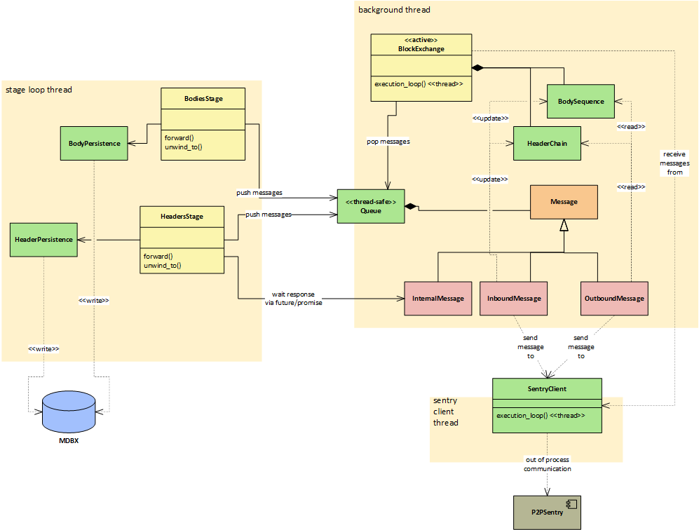

# Block Downloader

The block downloader is the component that has the responsibility to download block headers and block bodies. 

It is always active and performs some operations on its own (e.g. handling connection to the Sentry component, replying to received devp2p messages...), some other operations (e.g. making new requests to download more headers or bodies) are instead driven by the stage-loop.

## Architecture

The following diagram depicts the overall architecture:

The header downloader is split in two classes:

- **HeadersStage**: governs the header download process and save headers on the db using the read-write tx
  received from the stage-loop; it has `forward` and `unwind_to` methods
- **BlockExchange**: receives messages (new headers, requested headers, request for headers, ...) from remote peers
  and from the `HeadersStage` and it acts on `HeaderChain` (using the "command pattern")

In the same way the body downloader is divided in two classes:

- **BodiesStage**: governs the body download process and save bodies on the db using the read-write tx received
  from the stage-loop; it has `forward` and `unwind_to` methods
- **BlockExchange**: receives messages (new bodies, requested bodies, request for bodies, ...) from remote peers
  and from the `BodiesStage` and it acts on `BodySequence` (using the "command pattern")

Two classes have the responsibility to implement header and body download algorithms: **HeaderChain** and
**BodySequence**. They are members of **BlockExchange** whose responsibility is to receive messages and process them.
Communication among such objects is carried by message-passing techniques. Three types of messages are present:
- incoming messages from remote peers (for example: hash announcements, headers, bodies, ...) are routed to `HeaderChain` and `BodySequence`
- outgoing messages to remote peers (for example: new header or bodies needed) contain information from `HeaderChain` and `BodySequence`
- internal messages are a design choice to share information between objects in different threads

Threading model:

- **stage classes** run in the same thread as the stage-loop
- **BlockExchange** runs in its own thread and uses message-passing as communication mechanism with the other threads
- **SentryClient** runs in its own thread

## Code organisation

Directories:

- downloader: contains the main classes that are exposed outside
- rpc & packets: contains the code that wraps the gRPC interface with the Sentry
  - rpc: each class embodies a remote procedure call of the Sentry interface
  - packets: each class is a data packet that can be sent or received via one rpc
- messages: divided in inbound messages and outbound messages
  - inbound msgs: modularize the code to handle incoming packets
  - outbound msgs: modularize the code that makes requests generating outgoing packets
- internals: implementation classes
  - header_chain: code that implements the header downloading process 
  - body_sequence: code that implements the body downloading process
  - header_persistence: code that saves headers to mdbx
  - body_persistence: code that saves bodies to mdbx
  - other stuff: utilities
    

