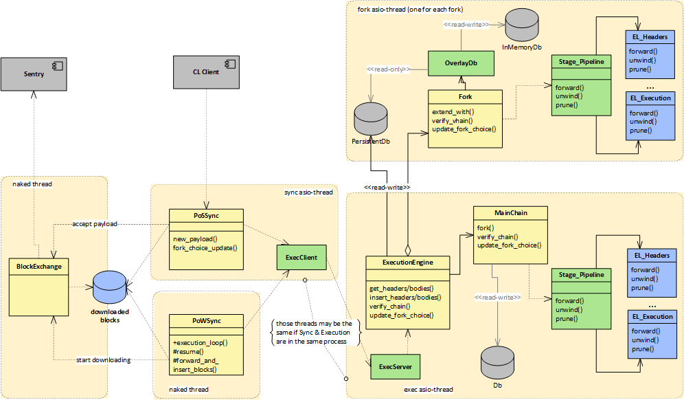

# Sync
Sync component is responsible for chain synchronization. 
To carry on this task it asks blocks from peers, save blocks to Execution database, detects forks, asks Execution for 
chain verifications, applies consensus rules and takes decision on forks.

There are actually two distinct implementations of Sync: 
- **PoWSync**: implement the block synchronization logic of a PoW chain; it executes cycles of block downloading & block validation
- **PoSSync**: implement the Execution Interface of the Ethereum PoS chain and needs an external Consensus Client

Other components of Sync are:
- **BlockExchange**: responsible for downloading blocks from the network
- **SentryClient**: responsible for connecting to the Sentry component  

## Sync-Execution interaction
The following diagram depicts the overall architecture of the

Sync and Execution are two independent components structured in a client-server architecture as per Torax architecture.
The Sync component is the client and the Execution component is the server. They can be instantiated in process or 
out of process using a gRPC interface.

## BlockExchange

The BlockExchange is the component that has the responsibility to download block headers and block bodies. 

It is always active and performs some operations on its own (e.g. replying to received devp2p messages, downloading
more headers or bodies up to a target, ...); it is driven by the Sync component that sends it messages to start/stop
the downloading process or to set downloading targets.

Two classes have the responsibility to implement header and body download algorithms: **HeaderChain** and
**BodySequence**. 

Communication among such objects is carried by message-passing techniques. Three types of messages are present:
- incoming messages from remote peers (for example: hash announcements, headers, bodies, ...) are routed to `HeaderChain` and `BodySequence`
- outgoing messages to remote peers (for example: new header or bodies needed) contain information from `HeaderChain` and `BodySequence`
- internal messages are a design choice to share information between objects in different threads

When the BlockExchange is asked to download blocks up to a target, it instructs the HeaderChain to download headers;
when headers are ready they are transferred to BodySequence that carry on the task to download corresponding bodies.
Then, the ready blocks are put on the thread-safe queue `BlockQueue` that is read by the Sync component.
    

